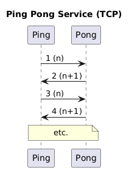
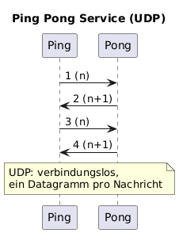
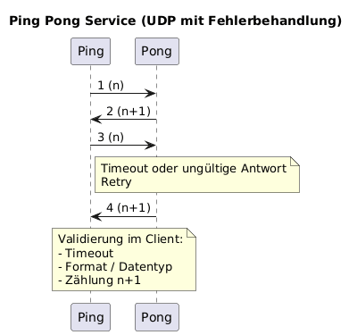
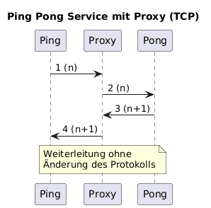

## pa_netzwerktechnologie
# Projektarbeit für Netzwerktechnologie TEKO

---

# Projekt Ping Pong (Level 1)

---

Dieses Projekt implementiert ein einfaches, aber erweiterbares Ping-Pong-Protokoll in Python auf Basis von UDP / TCP. 
Ein Ping-Client sendet eine Zahl (den sogenannten Spin) an einen Pong-Server, welcher darauf mit einer modifizierten Antwort reagiert.
Das Projekt ist modular aufgebaut, sodass jede Erweiterung separat (z. B. in einer eigenen Datei) umgesetzt werden kann.

---

## Funktionen
Das Projekt umfasst folgende Funktionen und Erweiterungen:

### Basic Ping-Pong TCP
- Ein Ping sendet eine Zahl `n` (Spin)
- Der Pong antwortet mit `n + 1`

Die Ping Pong Anwendung besteht aus einem Server und einem Client
- `ping_client.py` - Ping Client (TCP)
- `pong_server.py` - Pong Server (TCP)

### Basic Ping-Pong mit UDP
- Ein Ping sendet eine Zahl `n` (Spin)
- Der Pong antwortet mit `n + 1`

Die Ping Pong Anwendung besteht aus einem Server und einem Client
- `udp_ping_client.py` - Ping Client (UDP)
- `udp_pong_server.py` - Pong Server (UDP)

### Ping Pong mit UDP und Fehlerbehandlung
- UDP Ping Pong mit Validierung, Timeout, falscher Zählung
- UDP kann Pakete verlieren oder Müll liefern. Der Client implementiert Timeout+Retry, prüft das Antwortformat und den Datentyp,
und validiert zusätzlich semantisch, dass die Antwort exakt n+1 ist.

Die Pingpong Anwendung besteht aus einem Server und einem Client
- `udp_pong_server.py`
- `udp_ping_client.py`

### Ping-Pong mit Proxy
- Ein Proxy leitet Ping- und Pong-Nachrichten weiter per default von Port 9005 (Client) zu Port 9000 (Server)
- Nach TCP und UDP Basic habe wir einen Proxy implementiert, um die Trennung von Client, Vermittler und Service zu zeigen. 
Der Proxy verlängert die Kommunikationsstrecke, ohne das Protokoll zu verändern.

Die Proxyanwendung besteht aus folgender Datei: 
- `proxy.py` - Proxy Server

---

## Voraussetzungen
Für die Ausführung des Projekts werden folgende Voraussetzungen benötigt:

- Python 3.11 oder höher
- Betriebssystem mit Netzwerkunterstützung (Linux, macOS oder Windows)
- Grundlegende Kenntnisse in:
  - Python
  - Netzwerkprogrammierung (UDP/TCP)
  - Kommandozeile mind. 3 Tabs für alle Funktionen

---

## Bedienungsanleitung

### Betrieb Server TCP
Folgende Datei wird dazu benötigt: `pong_server.py`

Starten des Pong Servers über folgenden Befehl in der Kommandozeile:
`py Code\pong_server.py --host 127.0.0.1 --port 9000`

Dann erscheint folgendes: ``Pong server listening on 127.0.0.1:9000`` somit ist der Server einsatzbereit und hört Port 9000 ab.

Für die Beendung des Servers, muss in der Commandline `Ctrl + C` gedrückt werden.

### Betrieb Client TCP
Folgende Datei wird dazu benötigt: `ping_client.py`
> Voraussetzung der Server läuft!

Folgender Befehl wird in einem Seperaten Terminal/Commandline ausgeführt: `py Code\ping_client.py --host 127.0.0.1 --port 9000 --n 41`

Die Zahl weche hinter `--n` steht, kann beliebig verändert werden. Bei der Server wird immer die Zahl X+1 wiedergeben.

`--n` muss eine Ganzzahl sein, ansonnsten wird der Client eine Fehlermeldung ausgeben. `error argument --n: invalid value: "X"

---

### Betrieb Server UDP
Folgende Datei wird dazu benötigt: `udp_pong_server.py`
Starten des Pong Servers über folgenden Befehl in der Kommandozeile:
`py Code\udp_pong_server.py --host 127.0.0.1 --port 9000`

Dann erscheint folgendes: ``Pong server listening on 127.0.0.1:9000`` somit ist der Server einsatzbereit und hört Port 9000 ab.

Für die Beendung des Servers, muss in der Commandline `Ctrl + C` gedrückt werden.

### Betrieb Client TCP
Folgende Datei wird dazu benötigt: `udp_ping_client.py`
> Voraussetzung der Server läuft!

Folgender Befehl wird in einem Seperaten Terminal/Commandline ausgeführt: `py Code\udp_ping_client.py --host 127.0.0.1 --port 9000 --n 41`

Die Zahl weche hinter `--n` steht, kann beliebig verändert werden. Bei der Server wird immer die Zahl X+1 wiedergeben.

`--n` muss eine Zahl sein, ansonnsten wird der Client eine Fehlermeldung ausgeben. `error argument --n: invalid value: "X"

---

### Betrieb Server und Client UDP mit Fehlerbehandlung
> Ähnlich wie bei UDP ohne Fehlerbehandlung, hier sind 3 Szenarien möglich.

Folgende Dateien werden benötigt: `udp_pong_server_valid.py` und `udp_ping_client_valid.py`

Folgende Befehle werden wie bei Basic in die Kommandozeilen eingetragen.
#### Normalbetrieb (Alles korrekt)
Server: `py Code\udp_pong_server_valid.py --host 127.0.0.1 --port 9004`
Client: `py Code\udp_ping_client_valid.py --host 127.0.0.1 --port 9004 --n 41 --id 7`

#### Falscher Datentyp (Server sendet Text)
Server: `py Code\udp_pong_server_valid.py --host 127.0.0.1 --port 9004 --send-text`
Client: `py Code\udp_ping_client_valid.py --host 127.0.0.1 --port 9004 --n 41 --id 7 --timeout 0.3 --retries 3`
Info: Client erkennt abc als ungültig, macht retrys und beendet nach Timeoutzeit. 

#### Falsche zählung (Server sendet n+2)
Server: `py Code\udp_pong_server_valid.py --host 127.0.0.1 --port 9004 --wrong-reply`
Client: `py Code\udp_ping_client_valid.py --host 127.0.0.1 --port 9004 --n 41 --id 7`
Info: Client erkennt Pongzahl als ungültig und gibt Meldung darüber. 

### Betrieb Proxy Server für TCP
Folgende Datei wird dazu benötigt: `proxy.py`, `pong_server.py` und `ping_client.py`

Start Server: `py Code\pong_server.py --host 127.0.0.1 --port 9000`
Start Proxy Server: `py Code\tcp_proxy.py --listen-host 127.0.0.1 --listen-port 9005 --target-host 127.0.0.1 --target-port 9000`
Ping Client gegen Proxyserver: `py Code\ping_client.py --host 127.0.0.1 --port 9005 --n 41`

